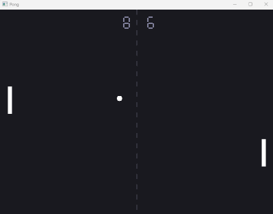
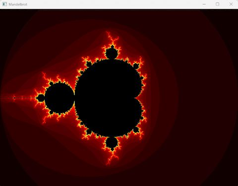

<div align="center">

<picture>
  <source media="(prefers-color-scheme: dark)" srcset="www/img/clx-logo-dark.png">
  <source media="(prefers-color-scheme: light)" srcset="www/img/clx-logo-light.png">
  
</picture>
<br /><br />

Cross-platform ahead-of-time Lua compiler


[](https://ko-fi.com/samirtine)

</div>
<br /><br />

**clx** is a cross-platform ahead-of-time Lua compiler and runtime that generates standalone native executables through modern C++ toolchains.
**clx** is not trying to be the fastest Lua implementation in every workload.

## Quick Start

```bash
git clone https://github.com/samyeyo/clx.git
cd clx
./build.sh install       # or build.bat install on Windows
clx examples/hello/hello.lua
./hello

Hello clx !
```

## Features

- **Competitive performance** with strong results on many AOT-friendly workloads
- **No bytecode interpreter overhead** — compiles to standalone native executables
- **Aggressive optimizations** — leverages modern optimizations via Clang/GCC/MSVC
- **Small binaries** — size-oriented builds can produce very compact executables (Lua programs can be under 100 KB with `--minimal`)
- **Targets Lua 5.5 compatibility** — coroutines, metamethods, tables, and more
- **16-byte tagged values** — 8-byte payload + separate type tag
- **Inline string** optimization (strings ≤ 6 bytes stored in value, no allocation)
- **Fast-path** table access caches
- **Lightweight** AOT-oriented runtime
- **clx C++ API**: develop portable native modules using a value-oriented API

## Examples built with **clx**

**clx** comes with examples, that uses a Sokol clx binary module for graphics, and demonstrate native desktop application development with standard Lua code.

### Pong



**pong** : a complete game written in Lua and compiled into a standalone native executable.

### Mandelbrot viewer



**Mandelbrot** : a Mandelbrot viewer written in Lua and compiled into a standalone native executable.

## Project status

**clx** is currently in beta.
The compiler is already capable of compiling non-trivial Lua applications, but compatibility work and optimization improvements are ongoing.

## Requirements

- **Linux**: `g++` or `clang++`
- **macOS**: `clang++` (Xcode) or `g++` via Homebrew
- **Windows**: `g++` (LLVM) or MSVC
- **CMake 3.15+** for building

> **Note:** The compiler used to build `clx` is fixed at build time via CMake and used for all Lua script compilation. This ensures ABI compatibility between the runtime libraries and generated code. Rebuild clx with a different compiler if you need a different backend.

## Build

### POSIX

```bash
./build.sh              # Release (default)
./build.sh debug        # Debug
./build.sh clean        # Removes build/ + /usr/local install
./build.sh install      # Release + install to /usr/local
./build.sh uninstall    # Removes installed files in /usr/local
```

### Windows

```bash
./build.bat              # Release (default)
./build.bat debug        # Debug
./build.bat clean        # Removes build/ + ./bin and ./lib
./build.bat install      # Release + install to /bin and ./lib
./build.bat uninstall    # Removes previously installed clx
```

Also works directly with CMake:

```bash
mkdir -p build && cmake -S . -B build && cmake --build build
```

Once compiled, you will find :

- `build/clx` — The compiler executable
- `build/libclx.a` — Static runtime library
- `build/libclx_size.a` — Static runtime library optimized for size

## Usage

```bash
./build/clx file.lua                         # Compile to executable (default flags)
./build/clx --object file.lua                # Object file (.o/.obj)
./build/clx --static file.lua                # Static clx module (.a/.lib)
./build/clx --cpp file.lua                   # Generate C++ source, don't compile
./build/clx file.lua -O2                     # Forward unknown clx flags to the backend compiler (here MSVC)
./build/clx file.lua --output f.exe          # Custom output name
./build/clx file.lua --debug                 # No optimizations, debug symbols
./build/clx file.lua --minimal               # base + package modules only
./build/clx file.lua --fast                  # Optimize for speed
./build/clx file.lua --size                  # Optimize for size (default)
./build/clx --version                        # Print version
./build/clx --help                           # Display help
```

#### Compatibility

**clx** targets Lua 5.5 compatibility.

Current status:

- Core language: largely implemented
- Tables and metatables: implemented
- Coroutines: implemented
- Modules: implemented
- Most standard libraries: implemented

See **[compatibility.md](doc/compatibility.md)** for detailed status.

#### Known limitations
- **`load()` / `loadfile()` / `dofile()`** — available only when the generated program is compiled with `--dynamic`; the source executes in the embedded Lua VM rather than in the AOT code path. They are absent from ordinary and `--minimal` builds.
- **AOT `string.dump()` / `debug`** — these are not provided by the clx AOT runtime. Dynamic code uses the embedded VM’s own standard libraries when compiled with `--dynamic`.
- The traditional Lua C API is not supported.
- Binary modules should be written using the clx C++ API.

See [Dynamic Lua](./doc/dyamic-lua.md) for activation, environments, `require`, and bridge limitations.

## Test suite

```bash
./tests/run.sh              # POSIX
./tests/run.bat             # Windows
```
Each `.lua` in `tests/` is compiled to a binary and executed. Tests print `[OK]`/`[FAIL]` per assertion.

## Benchmarks

Results are expressed in speedup factor against standard Lua 5.5 interpreter :

| Script | lua 5.5 | LuaJIT | clx `--fast` |
|--------|---------|--------|--------------------------|
| fib.lua | 0.299s (1.00x) | 0.044s (6.80x) | **0.007s (42.71x)** |
| arraysum.lua | 0.317s (1.00x) | 0.098s (3.23x) | **0.083s (3.82x)** |
| spectralnorm.lua | 0.382s (1.00x) | **0.020s (19.10x)** | 0.036s (10.61x) |
| canada.lua | 0.347s (1.00x) | **0.134s (2.59x)** | 0.231s (1.50x) |
| warmup.lua | **0.003s (1.00x)** | 0.005s (0.60x) | 0.006s (0.50x) |

> Measured on Intel® Core™ i5 Ultra 125U CPU @ 4.30GHz · Linux · GCC 13.3.0 · Avg of 10 runs

> Full benchmarks are available in **[clx benchmarks](./doc/benchmarks.md)**

## Documentation

Documentation is available in the `doc/` directory, including :

- Getting Started
- CLI Reference
- Dynamic Lua loading
- Compatibility Status
- Modules and Migration Guide
- C++ API Reference
- Runtime Internals
- Architecture Overview
- Optimizations
- Benchmarks

See **[Documentation Index](./doc/index.md)**. For runtime Lua loading, see **[Dynamic Lua](./doc/dyamic-lua.md)**.

## License

**clx** is MIT Licensed — Copyright (c) 2026 Tine Samir
