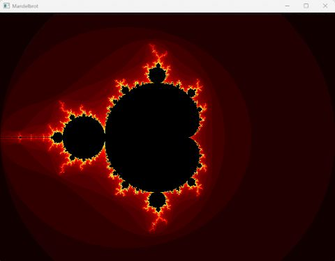

# Mandelbrot 

<div align="center">

<picture>
  
</picture>
</div>
<br /><br />

This desktop example computes and displays a Mandelbrot fractal.

Unlike microbenchmarks focused on recursion or table access, Mandelbrot spends most of its time performing floating-point arithmetic inside tight loops.

This makes it representative of numeric workloads that can benefit from ahead-of-time compilation and backend compiler optimizations.

## Build

### POSIX

```bash
./build.sh
```

### Windows

```bash
./build.bat
```

## Run

```bash
./mandelbrot
```

The program opens a Window that contains the Mandelbrot fractal.