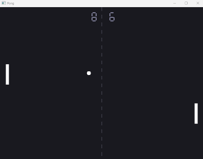

# Pong

<div align="center">

<picture>
  
</picture>
</div>
<br /><br />


This example demonstrates a complete Pong game written in Lua and compiled to native code with clx, as a single executable with no dependencies.

The game uses a Sokol-based native module linked through the clx C++ module API.

## Features

* Real-time rendering
* Keyboard input
* Collision detection
* Score tracking
* Native graphics backend

The purpose of this example is to demonstrate that clx can be used for real-world applications beyond microbenchmarks and synthetic tests.

## Building

### POSIX systems
```bash
./build.sh
```

### Windows
```bash
./build.bat
```

Typical executable size of pong executable is `~500 KB`, including:

* Pong game logic
* Sokol graphics backend
* clx runtime

## About Sokol

This example uses the Sokol graphics library.

Sokol is a lightweight, cross-platform graphics framework designed for small native applications and games.

## Purpose

This example is included to demonstrate:

* Native module integration
* Real-world Lua applications
* Module linking support
* Cross-platform deployment
* clx runtime capabilities

It is not intended as a game framework, but as a practical demonstration of the clx ecosystem.
